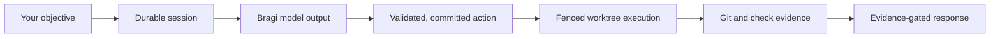

<p align="center">
  
</p>

# Midgard

**Keep local coding agents observable, steerable, and accountable.**

Midgard is a local coding-agent harness with durable sessions, controlled tool
use, and evidence-gated completion. It gives an agent a disposable Git
worktree, lets you watch and steer the work in a terminal chat, and retains the
evidence needed to understand what happened after a turn ends.

An agent can inspect code, search a repository, edit files, run checks, and
explain its result. Midgard keeps the boundary between those steps explicit: a
model may propose work, but Midgard validates, commits, dispatches, and records
the result before it treats any side effect or completion claim as trustworthy.

> **Status:** Midgard is an experimental local prototype. It has a working
> coding-chat vertical, but its current executor runs agent-authored commands directly
> on the host. It is not a sandbox, a multi-user service, or safe for untrusted
> repositories or credentials.

## A coding turn, made inspectable

Imagine asking Midgard to add a feature to an existing repository:

```sh
midgard -repo /path/to/repository \
  "add durable persistence with restart tests"
```

Midgard opens a session in a disposable worktree. While the agent works, the
terminal chat shows compact progress: what it explored, commands it ran, files
it changed, checks that passed or failed, and the final explanation. You can
queue follow-up guidance, stop at a safe boundary, return later, or review the
resulting diff without losing the durable record of the turn.

Under the hood, an objective follows this route:



The model can revise a draft request while generating. Only an accepted Bragi
host-action proposal reaches Midgard's action lifecycle, and no external command
runs before its exact intent is durably committed and dispatched. A final model
message is not enough to finish the turn: Midgard evaluates server-owned Git and
check evidence first.

## Why Midgard exists

Coding agents are useful only when their work remains understandable and
recoverable. A long text transcript alone does not answer practical questions:

- What did the agent actually run?
- Which files changed, and in which worktree?
- Did the requested check pass?
- What was still in flight when the terminal closed?
- Can a follow-up continue safely from the same work?

Midgard makes those answers part of the runtime rather than an afterthought.

| Concern | What Midgard keeps durable |
| --- | --- |
| Conversation | Sessions, turns, user messages, assistant responses, steering, and interruption notices. |
| Intent and effects | Versioned action intent, validation, commit, worker fence, dispatch, and server-authored result. |
| Model behavior | Credential-free native request/response traces, usage, and replay state as immutable artifacts. |
| Source state | A session-owned Git worktree, bounded edits, diffs, and repository check evidence. |
| Runtime configuration | Named environment revisions and provider/profile provenance—never secret values in prompts, state, artifacts, or the TUI. |

This is deliberately narrower than an autonomous development platform. Midgard
does not make a planner, a workflow language, or a model response the source of
truth. It is the small control layer around a coding turn.

## Start locally

Clone the repository, build from its root, and authenticate a provider once:

```sh
go install ./cmd/midgard
midgard auth login deepseek
```

Then open the current Git repository's session home:

```sh
midgard
```

Or begin a task immediately:

```sh
midgard "explain this repository and identify the next useful change"
```

Use `-repo PATH` to target another repository, `-profile NAME` to select a
stored provider profile, and `-headless` for the original one-turn text
interface. `midgard help` lists the full command surface.

Provider keys are stored in the operating system keyring. An existing
environment variable can be migrated only through the explicit
`auth login --from-env NAME` command; Midgard has no secret-reveal command.
The local Codex bridge reuses Codex's own login material and never imports it
into Midgard.

## What the terminal chat gives you

The attached terminal interface is a workspace for an active coding turn, not a
decorative token stream:

- Live activity distinguishes preparation, model work, tool execution, checks,
  success, and failures without showing hidden reasoning text.
- File edits collapse into readable per-file change summaries and bounded,
  colored diffs; routine command output stays compact.
- `/` opens a filtered command menu. Use `/skills`, `/env`, `/repo add`,
  `/model`, and `/auth` to open focused interfaces instead of memorizing flags.
- Type guidance while the agent works and Midgard applies it at the next safe
  boundary. `/stop` requests a controlled stop; `Ctrl+C` clears only the
  composer.
- Reopen a session to continue in its worktree. If a command's outcome is
  unknown after interruption, Midgard says so and asks the next turn to inspect
  the repository rather than pretending it knows the result.

See the [terminal-chat guide](docs/tui.md) for the interaction contract and
recovery behavior.

## Reusable environments and project context

Midgard replaces duplicated project `.env` files with named runtime
environments. Plain settings live in Midgard's environment catalog; secret
values remain only in the OS keyring. Environments can inherit from one parent
and can be shared by unrelated projects.

```sh
midgard env create shared-services
midgard env set shared-services LOG_LEVEL debug \
  --description "logging verbosity"
midgard env set-secret shared-services SENTRY_DSN \
  --description "production error reporting"
midgard env use shared-services
```

The model sees names, kinds, descriptions, and revision provenance—not values.
Midgard injects values only into a shell or check child process after its action
is durably committed and dispatched. That prevents accidental exposure through
normal runtime state, but it does not make an agent-controlled process safe to
trust with a production credential. Read the
[environment decision](docs/decisions/0005-runtime-environments.md) before using
real secrets.

A project is a logical, named set of repositories rather than a shared parent
directory. Start in one repository without setup; add another later when the
work requires it:

```text
/repo add /path/to/another/repository
```

Midgard retains stable project and worktree identities as the project grows.
Read [logical projects](docs/decisions/0004-rootless-logical-projects.md) for
the exact model.

## What Midgard does—and does not—control

Midgard is the action authority around a model, not a replacement for every
component of an agent stack.

- It uses [Bragi](https://github.com/coadan/bragi) as the model-to-harness
  protocol. Provider-native streams remain trace evidence; they do not directly
  authorize tools.
- It owns session ordering, action validation through result, worktree fences,
  and evidence-based completion.
- It can bundle local repository search through Yggdrasil and browser QA through
  Heimdal, directing both at the session worktree.
- It does **not** yet provide production process containment, remote control,
  detached workers, a landing or pull-request workflow, a generic policy engine,
  or an autonomous task planner.

The current local executor is an explicit, temporary exception to the normal
sandbox requirement. Use Midgard only on a repository and machine you trust;
the [unsafe-local decision](docs/decisions/0002-unsafe-local-prototype.md)
defines the limitation and its removal gate.

## Verify a checkout

Run the full local verification suite from the repository root:

```sh
go test ./...
go test -race ./...
go vet ./...
go run ./cmd/midgard protocol-score \
  -manifest testdata/protocol/manifest.json
```

The protocol scorer verifies the pinned Bragi profile against committed action,
repair, rejection, and no-effect-before-acceptance fixtures.

## Learn more

- [Documentation index](docs/README.md) — guides, architecture, current status,
  and historical notes
- [Terminal chat](docs/tui.md) — commands, rendering, recovery, and interaction
  behavior
- [Agent skills](docs/skills.md) — discovery, bounded retrieval, groups, and
  project masks
- [Implementation status](docs/implementation-status.md) — completed stages,
  known limits, and gates
- [Action state transitions](docs/action-transitions.md) — durable action
  lifecycle and fences
- [Architecture decision records](docs/README.md#architecture-and-guarantees) —
  kernel boundary, environments, protocol, context budget, and Codex bridge
- [Contributing](CONTRIBUTING.md) — development and verification expectations
- [Security policy](SECURITY.md) — responsible disclosure and prototype scope

## License

Midgard is released under the [MIT License](LICENSE).
