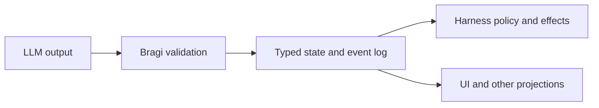

# Bragi

**Make partial LLM output useful, structured, and safe.**

Bragi is a streaming protocol for agent harnesses. It makes partial model
output first-class for display: typed, validated, addressable state that a UI
can render as soon as each record arrives—not an incomplete blob waiting for
the full response to finish.

The model can build that state incrementally, correct it before it is final,
and explicitly propose when an action is ready. The harness remains in control
of what is trusted, shown, executed, and considered complete.

## Partial output as a product primitive

Imagine a coding agent beginning to plan a change:

```text
+ @s1 plan_step
+ @s1.intent "Add deterministic replay"
```

The response is not finished, but the harness already has something useful: a
validated `plan_step` draft with stable identity `@s1`. A UI can immediately
render a plan card titled **Add deterministic replay** while generation
continues. Later records enrich the same card:

```text
+ @s1.acceptance "Replaying the same log produces the same state"
~ @s1.intent "Add deterministic replay for accepted records"
+ @s1.status "planned"
! @s1
```

Each accepted record produces a small, predictable display update:

| Record | What the UI can do |
| --- | --- |
| `+ @s1 plan_step` | Reserve a stable plan item keyed by `@s1`. |
| `+ @s1.intent ...` | Show the plan item as soon as its title is useful. |
| `+ @s1.acceptance ...` | Add acceptance criteria to the existing card. |
| `~ @s1.intent ...` | Correct the title in place without adding a duplicate. |
| `+ @s1.status ...` | Display a typed status. |
| `! @s1` | Mark the validated revision as committed. |

The UI does not need to reparse a growing Markdown response or rebuild a whole
JSON document on every token. It projects typed changes onto components keyed
by stable entity IDs. If generation stops between records, the accepted prefix
remains displayable as a draft. Nothing incomplete is guessed, and nothing is
accidentally committed.

Partial does not mean indiscriminate. Profiles can define publication guards,
so content stays hidden until fields such as speaker, audience, or channel are
known. The harness decides which validated drafts are safe and useful to show.

This is the core value of Bragi: an agent harness can react to meaningful,
structured progress throughout generation—rendering plans, messages,
artifacts, checks, findings, and tool requests as they take shape rather than
waiting for one final object.

> Bragi gives models room to revise their intent while the harness retains
> control over state, effects, and completion.

> **Status:** Bragi 1.x has a stable protocol boundary and a working Go
> reference implementation. Adoption remains experimental until the
> [benchmark gate](docs/benchmark.md) passes across at least two model families.

## Why Bragi exists

LLMs generate from left to right. Useful information appears gradually, and a
better answer may become clear only after an earlier value has already been
emitted.

Most structured interfaces work differently. They expect a complete object or
tool call before the result becomes useful. If generation stops halfway
through, the harness may be left with invalid JSON. If the model needs to
correct a value, it may have to regenerate the object or issue another call.
If tool-call completion is treated as execution approval, uncertainty can turn
into an effect too quickly.

Bragi makes partial output a first-class part of the protocol:

- every complete line can update typed draft state;
- the model can correct or retract draft values in-band;
- a cutoff preserves the accepted prefix;
- stable IDs keep entities recognizable across updates and replay; and
- an explicit commit proposal separates “this is my intended request” from
  “the harness authorizes this action.”

The result is a small model-facing language and a conventional, validated state
model for the rest of the system.

## The four operations

Bragi uses four primary operators:

| Operator | Plain-language meaning |
| --- | --- |
| `+` | Create something or add a value. |
| `~` | Replace a draft value. |
| `-` | Remove a draft value. |
| `!` | Seal text or propose an entity for commit. |

Entities have stable IDs such as `@t1`. A
[profile](profiles/midgard-v1.md) tells the model and runtime which entity
types and fields are available for a domain.

This is enough to build tool requests, messages, artifacts, findings, checks,
questions, completion proposals, and other typed objects without requiring one
large nested response.

## A practical example

Imagine a coding agent preparing a command. It first chooses the ordinary test
suite, then realizes the task needs the race detector:

```text
+ @t1 tool
+ @t1.name "shell.run"
+ @t1.arguments.command "go test ./..."
~ @t1.arguments.command "go test -race ./..."
+ @t1.reason "Check concurrent access before accepting the change"
! @t1
```

What the different parts of the system see:

1. The model builds a draft one field at a time.
2. The replacement updates the current command without erasing its history.
3. `! @t1` asks the Bragi runtime to validate the current revision.
4. A successful commit makes the request eligible for host policy.
5. The harness still checks its sandbox, capabilities, budget, idempotency, and
   task state before dispatching anything.

No source line directly runs a command.

## How Bragi fits into a harness

Bragi separates responsibilities that are often bundled together:



- The **model** constructs and revises intent.
- The **Bragi runtime** validates records and maintains canonical state.
- The **harness** owns tools, policy, side effects, budgets, and task
  completion.
- The **UI** renders a projection of state; it does not become the source of
  truth.

This distinction matters most around actions and completion. A valid tool
entity does not mean the tool ran. A model-authored completion proposal does
not mean the task is done. Those decisions belong to the harness and its
evidence.

## Where Bragi works best

Bragi is aimed at agent harnesses that:

- stream mixed structured output such as messages, tools, artifacts, plans,
  checks, and findings;
- want to expose useful partial state before a full response completes;
- need model-authored corrections without regenerating an entire object;
- persist sessions and require deterministic replay;
- distinguish proposed actions from authorized effects; or
- render live state in a UI using stable entity identity.

Bragi is not intended to replace provider APIs, MCP, JSON-RPC, WebSocket, SSE,
authentication, tool discovery, or host policy. It is the model-to-harness
language between provider token output and trusted application state.

## What the runtime guarantees

The detailed rules live in the [specification](docs/spec.md), but the central
guarantees are straightforward:

- A record is accepted or rejected as one unit.
- Rejected and incomplete records do not change state.
- Corrections append history rather than rewriting it.
- References point to specific committed revisions.
- Effectful entities cannot be edited after acceptance.
- Replaying canonical events reconstructs the same state without rerunning
  effects.
- Model EOF and model completion claims never end the task by themselves.

Bragi also permits a small, auditable set of mechanical recoveries for common
generation variations. It does not guess semantic intent, repair payloads, or
fuzzy-match tools and fields.

## Try it

The repository includes a Go 1.25 reference implementation and example
streams.

```sh
go test ./...
go run ./cmd/bragi-check \
  -profile profiles/midgard-v1.json \
  examples/*.bragi
```

Use `-json` to inspect the canonical events produced from a stream:

```sh
go run ./cmd/bragi-check \
  -json \
  -profile profiles/midgard-v1.json \
  examples/tool-repair.bragi
```

## Learn more

- [Bragi 1.0 specification](docs/spec.md) — normative syntax and semantics
- [Examples](examples/) — complete model-authored streams
- [Conformance](docs/conformance.md) — reference implementation and required
  properties
- [Grammar](grammar/bragi.ebnf) — machine-oriented syntax
- [Midgard profile](profiles/midgard-v1.md) — coding-harness domain model
- [WebSocket binding](docs/websocket-binding.md) — optional client projection
- [Evidence and readiness](docs/evidence.md) — design evidence and open
  questions
- [Benchmark plan](docs/benchmark.md) — adoption criteria and comparisons
- [Decision records](docs/decisions/README.md) — stable architectural choices

## Project status

The core Bragi 1.x grammar and semantics are stable. The reference decoder,
profile loader, materializer, replay path, conformance command, and fixtures
are implemented and tested.

Bragi's performance advantage is still a hypothesis. It should not replace an
existing model protocol until benchmarks show better recovery cost or
time-to-committed-action without a material loss in semantic validity.

## License

Bragi is released under the [Apache License 2.0](LICENSE).
